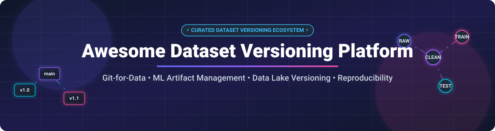

# 📊 Awesome Dataset Versioning Platform & Data Version Control Tools 🚀

  

  
  
  
  
  
  

## 📌 Top Dataset Versioning Platforms & Data Version Control Ecosystem 💡

**Curated List of SaaS Platforms, Data Lake Engines & Open-Source GitHub Projects**

*Focused on Dataset Versioning, ML Artifact Management, Git-for-Data, Data Lakehouse Branching & Machine Learning Reproducibility.*

**Last updated: October 2026** 📅

---

### 🔍 Overview & Market Intelligence 🌐

The **Dataset Versioning & Git-for-Data** market size is estimated at **$1.8 Billion - $2.5 Billion** (as part of the broader $12+ Billion MLOps and Data Management software market), with a projected CAGR of over 22%. 

The market is currently **moderately fragmented**: 
- **Data Lake & Lakehouse Versioning** is consolidating around object-storage zero-copy standards (e.g., lakeFS acquiring DVC's core team and Apache Iceberg catalog branching via Nessie).
- **MLOps Artifact Management** remains fragmented with specialized platforms (W&B, ClearML, Comet) competing against unified data platforms.
- **In-Database & Table Versioning** sees strong category leadership from Dolt (Git for SQL).

---

## 💼 SaaS / Hosted Dataset Versioning Platforms ☁️

| Platform | Starting Price | Free Tier Limits | Valuation / Revenue | Key Features & Focus |
| :--- | :--- | :--- | :--- | :--- |
| **[Weights & Biases Artifacts](https://wandb.ai/)** 🏋️‍♂️ | **$60 / user / month** (Pro Plan) | **Free Personal Plan**: Unlimited personal projects, 100GB artifact storage | **$1.25B Valuation** ($50M ARR) | Enterprise ML experiment tracking, artifact registry, and automated CI/CD model pipelines. |
| **[lakeFS Cloud](https://lakefs.io/)** 🌊 | **$499 / month** (Team Plan) | **30-Day Free Trial** (5 users, 500GB managed storage max) | **$43M Total Raised** ($20M Series A) | Managed Git-for-data for data lakes. Zero-copy branching, atomic commits, time travel on S3/GCS/Azure. |
| **[Qwak (JFrog ML)](https://www.qwak.com/)** 🐸 | **Contact Sales** (Enterprise / JFrog Integration) | **14-Day Free Trial** via JFrog Platform | **$230M Acquired** by JFrog (was $64M Valuation) | Integrated ML platform versioning data, code, parameters, and model builds into standardized registries. |
| **[Comet Artifacts](https://www.comet.com/)** ☄️ | **$19 / user / month** (Pro Plan) | **Free Individual Plan**: Single user, core experiment & artifact tracking | **$69.8M Total Raised** (~$17M ARR) | Dataset store and experiment tracker with Opik LLM evaluation & dataset lineage linking. |
| **[ClearML](https://clear.ml/)** ⚡ | **$15 / user / month** (Pro Plan) | **Free Community Plan**: Up to 3 users, 100GB storage, 1M API calls/mo | **~$4.5M ARR** ($7M Raised) | Hyper-datasets for unstructured visual data, versioned annotation frames, and self-hosted MLOps. |
| **[Datature](https://datature.io/)** 👁️ | **$99 / month** (Developer Plan) | **Free Starter Plan**: 300 images, 300 GPU training minutes, 1 user | **$2.7M Total Raised** (~$3.8M ARR) | Computer vision platform with versioned ontologies and annotation label preservation. |
| **[DoltHub](https://www.dolthub.com/)** 🐬 | **$5 / month** (Pro Plan) | **Free Public Databases**: Unlimited public storage & databases | **$23M Total Raised** (~$1.5M ARR) | Hosted Git-versioned SQL databases with pull requests, forks, branch permissions, and web SQL UI. |
| **[Iterative Studio](https://iterative.ai/)** 🔄 | **$50 / user / month** (Team Plan) | **30-Day Free Trial** (Free tier for open-source repos) | **Venture-Backed** (~$2.2M ARR) | Web UI hub for DVC projects, tracking experiments, model management, and Git-based data workflows. |
| **[Pachyderm](https://www.pachyderm.com/)** 🐘 | **Contact Sales** (Enterprise Edition) | **Free Open-Source Community Edition** (Self-hosted) | **Acquired by HPE** ($40M+ Raised prior) | Kubernetes-native data versioning engine with data-driven pipeline automation. |

---

## 🔓 Open-Source GitHub Projects 🛠️

Dataset versioning has a mature, production-proven open-source ecosystem. Projects below are sorted by GitHub star count (descending).

### 🏆 Open-Source Leaderboard

- **[Dolt](https://github.com/dolthub/dolt)** 🐬 
  **Git for Data — Version control built directly into the SQL database kernel.** MySQL-compatible database supporting native Git operations (`commit`, `branch`, `merge`, `diff`, `clone`) at **row-level granularity**. Dolt 2.0 provides optimized storage compression and faster query execution than standard MySQL.

- **[DVC (Data Version Control)](https://github.com/iterative/dvc)** 🔄 
  **Git-like version control for ML datasets, models, and pipelines.** Stores lightweight pointer files in Git while connecting large data assets to S3, GCS, Azure Blob, or custom remote caches. Fully language-agnostic and ideal for reproducible machine learning DAG pipelines.

- **[lakeFS](https://github.com/treeverse/lakeFS)** 🌊 
  **The leading Git-for-data platform for petabyte-scale data lakes.** Delivers **zero-copy branching**, atomic commits, and instant time-travel queries across S3, GCS, and Azure Blob storage. Fully compatible with Apache Iceberg, Delta Lake, Apache Hudi, and Hive formats.

- **[ModelDB](https://github.com/VertaAI/modeldb)** 🗄️ 
  **Open-source ML model versioning and metadata management system.** Tracks machine learning models, pipeline versions, hyperparameters, and associated dataset metadata across training lifecycles.

- **[Nessie](https://github.com/projectnessie/nessie)** 🦕 
  **Transactional catalog for data lakes with Git-like semantics.** Provides multi-table atomic commits, branching, merging, and tagging for Apache Iceberg tables. Integrates seamlessly with Spark, Trino, Flink, and Dremio query engines.

- **[Quilt](https://github.com/quiltdata/quilt)** 🧩 
  **Data mesh platform for versioning, packaging, and navigating data in AWS S3.** Organizes datasets into reusable, version-controlled data packages with built-in documentation and visualization capabilities.

- **[Oxen](https://github.com/oxen-ai/oxen-server)** 🐂 
  **Lightning-fast data version control system built in Rust.** Specifically optimized for large unstructured datasets (images, audio, video, text) with ultra-fast sync speed and Git-like CLI interface.

- **[ChiveSave](https://github.com/CHIVE-AI/chivesave-community-backend)** 🍃 
  **Self-hosted AI artifact versioning backend.** Lightweight FastAPI + PostgreSQL system featuring version saving, metadata previewing, rollback restoration, and RBAC authentication for small AI engineering teams.

- **[git-datasets](https://github.com/RuiFilipeCampos/git-datasets)** 📦 
  **Declarative ML dataset management and version control.** Enables data teams to create, transform, and version datasets directly within Python data science codebases.

- **[Jiaozifs](https://github.com/GitDataAI/jiaozifs)** 🥟 
  **Git-like version control file system for data lineage and data collaboration.** Provides efficient versioning for data assets and cloud storage repositories.

---

## 🤝 How to Contribute 📝

1. **Fork** this repository. 🍴
2. **Add/Edit entries** in `README.md` (ensure formatting matches existing tables/lists). ✏️
3. **Include details**: Name, website URL, pricing tier, free tier limits, star badges, and factual description. 🔍
4. **Submit a Pull Request** with a summary of changes. 🚀

Check out our curated list meta-repository: [Awesome-Awesome-Awesome](https://github.com/ishandutta2007/Awesome-Awesome-Awesome) ⭐

---

## 📈 Star History 🌟

---

## 💖 Support & Community 🙏

Thank you for exploring and supporting the **Awesome Dataset Versioning Platform** project! If you find this curated list valuable for your MLOps, Data Engineering, or Data Lakehouse journey, please consider supporting us:

- ⭐ **Star this repository** to help others discover it on GitHub.
- 🔀 **Fork it** to contribute new dataset versioning tools or update existing specs.
- 📢 **Share it** with your fellow data scientists, ML engineers, and data infrastructure teams.
- ☕ **Sponsor the Maintainer**: Support ongoing curation and maintenance via the Maintainer's [GitHub Sponsor Dashboard](https://github.com/sponsors/ishandutta2007).

---

## ⚠️ Disclaimer 📜

- This is a community-curated list and serves as an informational resource.
- Dataset versioning platforms handle sensitive data assets and ML models; verify security, governance, and compliance policies before production deployment.
